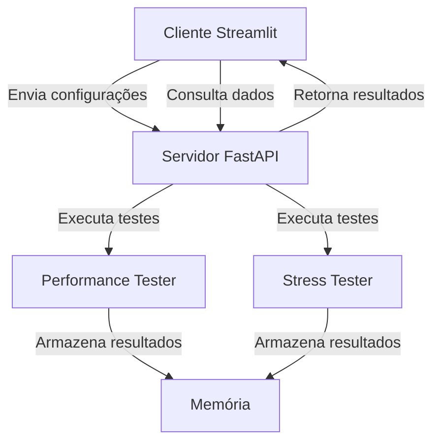

# Non-Functional Tester

Sistema para execução e monitoramento de testes de performance (carga) e stress em aplicações web, composto por um servidor API e um dashboard de visualização.

## Sumário
- [Visão Geral](#visão-geral)
- [Funcionalidades](#funcionalidades)
- [Arquitetura do Sistema](#arquitetura-do-sistema)
- [Pré-requisitos](#pré-requisitos)
- [Instalação e Execução](#instalação-e-execução)
- [Configuração dos Testes](#configuração-dos-testes)
- [API - Referência](#API---Referência)
- [Interface Web](#interface-web)
- [Estrutura do Projeto](#estrutura-do-projeto)
- [Tecnologias Utilizadas](#tecnologias-utilizadas)

## Visão Geral
Solução completa para testes não-funcionais que permite:
- Simular cenários de carga em endpoints HTTP
- Monitorar métricas de performance em tempo real
- Armazenar resultados históricos para análise comparativa
- Identificar gargalos e pontos de melhoria em aplicações web

## Funcionalidades
✔ Testes de stress com controle de concorrência  
✔ Testes de performance com duração configurável  
✔ Dashboard interativo com visualização de resultados  
✔ Armazenamento temporário de resultados  
✔ Configuração flexível de headers e payloads  

## Arquitetura do Sistema


## Pré-requisitos
- Python 3.10

## Instalação e Execução

### 1. Configuração do Ambiente
```bash
# Clone o repositório
git clone https://github.com/Otavio-CB/non_functional_tester.git

# Instale as dependências
pip install -r requirements.txt
```

### 2. Iniciar o Servidor API
```bash
uvicorn app.web_server_main:app --reload --reload-delay 10
```

### 3. Iniciar a Interface Web
```bash
streamlit run app/web_client_main.py
```

> **Acesso:**  
> API: http://localhost:8000  
> Streamlit: http://localhost:8501

## API - Referência

### Endpoints Principais

| Método | Endpoint                     | Descrição                                                                 | Parâmetros                                                                 |
|--------|------------------------------|---------------------------------------------------------------------------|----------------------------------------------------------------------------|
| POST   | `/stress-test`               | Inicia um teste de stress                                                 | `TestConfig` no body                                                       |
| POST   | `/performance-test`          | Inicia um teste de performance                                            | `TestConfig` no body                                                       |
| GET    | `/test-results/{test_id}`    | Retorna todos os resultados de um teste específico                        | `test_id: str` (path param)                                                |
| GET    | `/test-results`              | Lista todos os testes armazenados                                         | -                                                                          |
| GET    | `/resource-stats/{test_id}`  | Retorna estatísticas detalhadas de recursos (CPU, memória) de um teste    | `test_id: str` (path param)                                                |

## Interface Web
### Recursos Disponíveis
- **Painel de Controle:** Início rápido de testes
- **Monitoramento em Tempo Real:** Gráficos de requests/s, latência e erros
- **Histórico:** Comparação entre execuções anteriores

### Fluxo de Uso
1. Configure os parâmetros do teste
2. Inicie a execução
3. Acompanhe as métricas em tempo real
4. Analise o relatório completo ao finalizar

## Estrutura do Projeto
```
app/
├── __init__.py
├── web_server_main.py
├── web_client_main.py
├── web_server/
│   ├── __init__.py
│   ├── core/
│   │   ├── __init__.py
│   │   ├── base_tester.py
│   │   ├── performance_tester.py
│   │   └── stress_tester.py
│   ├── models/
│   │   ├── __init__.py
│   │   ├── config.py
│   │   └── results.py
│   ├── storage/
│   │   ├── __init__.py
│   │   └── memory_storage.py
├── web_client/
│   ├── __init__.py
│   ├── api/
│   │   ├── __init__.py
│   │   └── client.py
│   ├── components/
│   │   ├── __init__.py
│   │   ├── config.py
│   │   ├── monitoring.py
│   │   └── results.py
README.md
.gitignore
requirements.txt
```

## Tecnologias Utilizadas

### Backend
<a href="https://fastapi.tiangolo.com/" target="_blank"></a>
<a href="https://www.python-httpx.org/" target="_blank"></a>
<a href="https://www.uvicorn.org/" target="_blank"></a>

### Frontend
<a href="https://streamlit.io/" target="_blank"></a>
<a href="https://plotly.com/" target="_blank"></a>
<a href="https://pandas.pydata.org/" target="_blank"></a>
